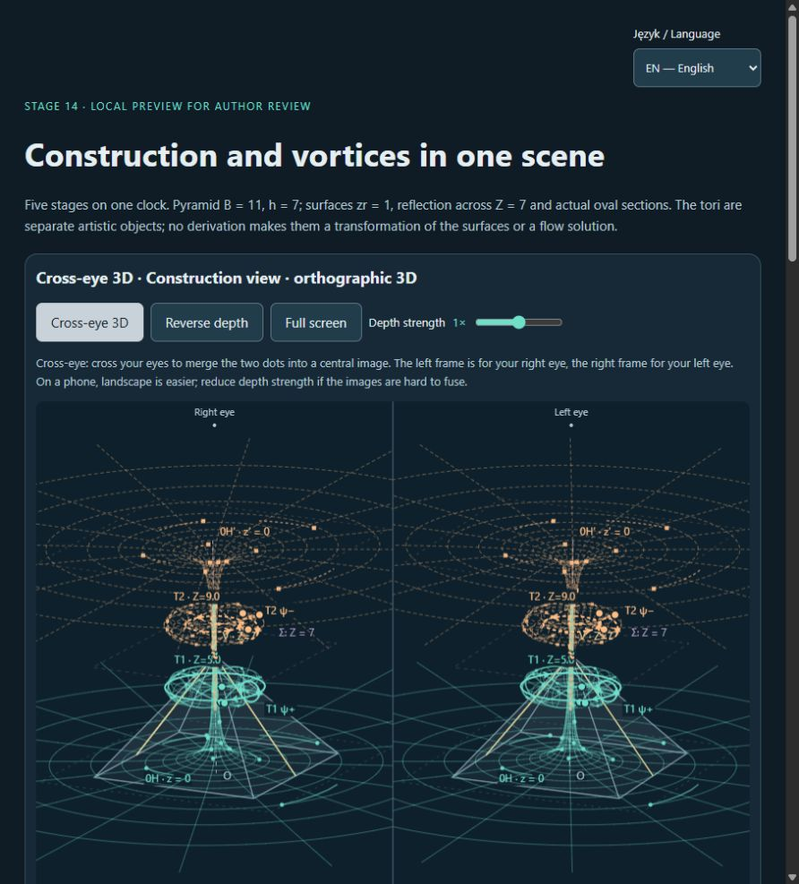

# Pyramid 11:7 — shared geometry and vortex preview

Concept: **Michał Przybylski — [prylski.dev](https://prylski.dev)**.

This source preview combines the translucent 11:7 pyramid, two mirrored
hyperbolic surfaces, cutting planes and their actual oval intersections,
with artistic toroidal vortices and particle trails. It reuses the stage
7–11 geometry, renderer and shared animation clock.

**Artistic visualization of counter-rotating toroidal vortices.**
The particles are not a Navier–Stokes fluid simulation or evidence of a
physical pyramid function. The toruses are separate presentation objects;
no mathematical transformation from a hyperbolic surface to a torus is claimed.
The cuts are ovals, not assumed ellipses, and near-golden proportions are
not exact identities. See the [detailed geometry notes](README.md).

## Open online

**[Open the educational show](https://michaelzp.github.io/great-pyramid-11-7-lab-edu/)** — no installation needed.
The dedicated [education website repository](https://github.com/MichaelZP/great-pyramid-11-7-lab-edu)
hosts the same scene and stage 7–11 dependencies, separate from the main
laboratory website. Select **Language → EN — English** above the title.

## Download and run

The complete preview source is on the `codex/education-show` branch.
Use Node.js 22 or newer and run:

```sh
git clone --branch codex/education-show https://github.com/MichaelZP/great-pyramid-11-7-lab.git
cd great-pyramid-11-7-lab
npm ci
npm run dev
```

Open **http://localhost:8080/education/**. Keep the terminal running.
Do not open `index.html` directly from the filesystem. If port 8080 is
already in use, use `npm run dev -- --port 8081` and open the same path
on port 8081.

For a phone on the same Wi-Fi network, open the Network address printed
by Vite and append `/education/`. Desktop viewport checks do not replace
physical-phone acceptance.

This branch publishes source code and evidence for review. The standard
application build, main laboratory website and Android APK do not include
this page. The dedicated education website has its own deployment.

To export the static site from this source checkout, run
`node scripts/export-education.mjs <new-empty-output-directory>`.
The exporter copies the scene and its existing dependencies without
changing the geometry, and checks local HTML links.

## Controls

- Select **Language → EN — English** above the title. The choice is saved
  when browser storage is available, without resetting the scene.
- **Full show** reveals five cumulative stages over 20 seconds: pyramid,
  first surface and cut, reflected system, toruses, then the full particle
  scene. All revealed elements remain visible. Motion continues at the end.
- Play, pause, reset and the progress slider use one clock. Pause stops
  particles and automatic camera motion. Manual camera interaction disables
  automatic rotation.
- Hyperbolic surface scaling is independent of the pyramid. Choose the
  extent with complete finite bases to inspect the full sampled surfaces;
  the infinite surfaces themselves have no finite mathematical base.
- Each surface and torus has an independent particle direction. Torus sizes
  and spacing are adjustable. The defaults retain the accepted mirrored
  cone motion and opposing torus directions.
- Layers, two optional Golden Egg solids and individual surface/egg
  transparency controls allow inspection without changing the actual cuts.
- Quality and reduced motion controls are available. Reduced motion shows
  stationary frames; disable it deliberately to animate the show.

## Cross-eye 3D

Enable **Cross-eye 3D** to display the right-eye view on the left and the
left-eye view on the right. Gently cross your eyes to merge the guide dots
and form a central stereoscopic image. No 3D glasses are required. Stop if
viewing causes discomfort. **Reverse depth** swaps the views, and depth
strength adjusts the camera difference without deforming the geometry.

Both views show the same frame, particle phases and layer settings.
Fullscreen and recording preserve the stereo pair when enabled.

## Recording and existing demonstrations

Choose English, the desired view and quality. Use **Recording frame** to
hide the panels, or **Record demo · 26 s** to record the five stages plus
six seconds of the final scene. Keep the tab visible, then download the
generated WebM. The Canvas recording includes the artistic disclaimer and
author credit. Escape restores the controls. Avoid editing source files
while recording: the development server can reload the page.

[demo-spirals.webm](demo-spirals.webm) is an existing 1280×720 VP9 recording
of the independent surface scaling and mirrored spirals. It uses the
earlier Polish single-view presentation; it does not demonstrate the later
English UI, stereo pair or optional egg controls. [Metadata and SHA-256](evidence/spirals-video-metadata.json).

An author-provided [YouTube video](https://youtu.be/rU60pHnWLYg) is also
available as a link. Its playback and metadata have not been independently
verified here.

## Verification

```sh
node --test docs/etap-7/animation.test.mjs docs/etap-10/vortex.test.mjs docs/etap-11/particles.test.mjs education/show.test.mjs
npm run typecheck
npm run test:run
```

Tests cover geometry preservation, reflected particle paths, independent
directions, torus controls, egg meshes, the single clock, pause/reset,
stereo projections and PL/EN switching. Browser evidence and the limits of
desktop phone-viewport checks are recorded in [STATUS](../docs/STATUS.md).


